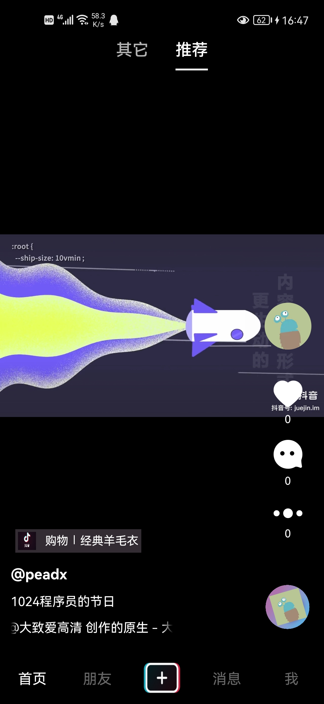
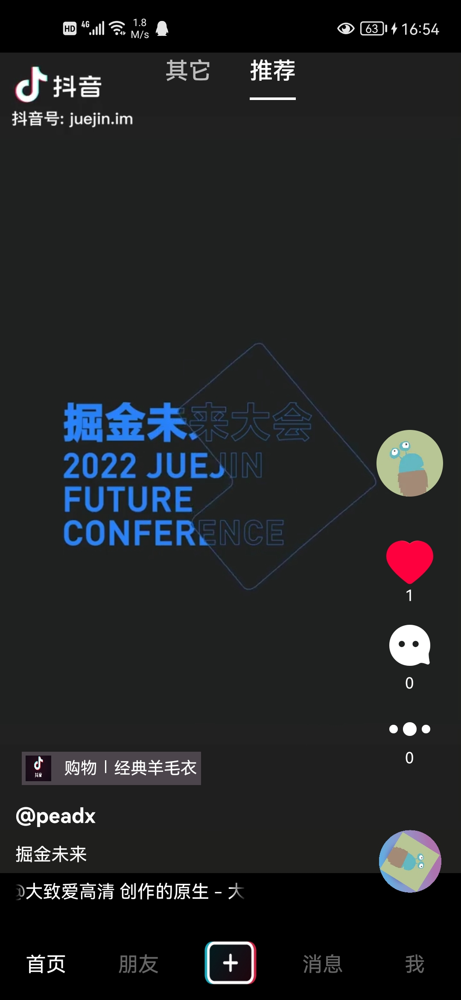
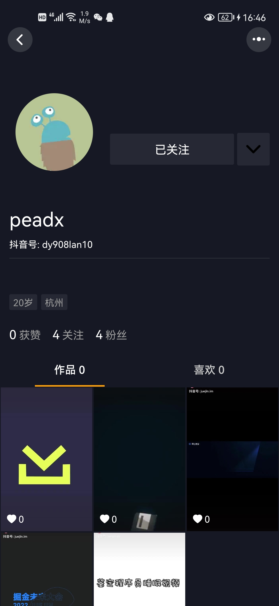
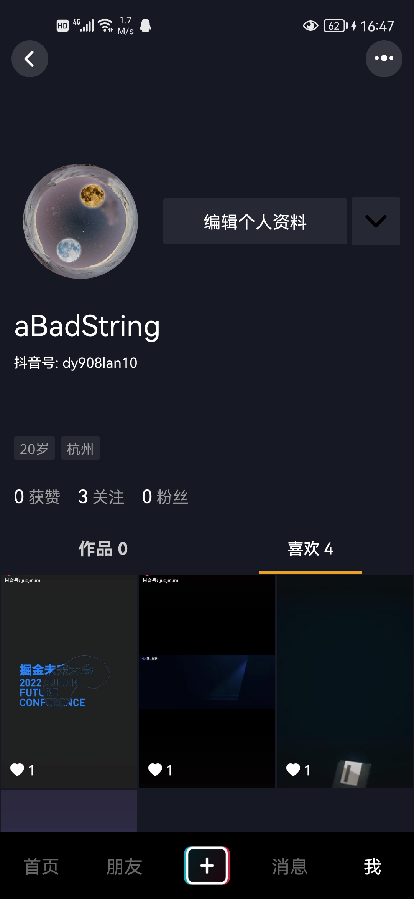
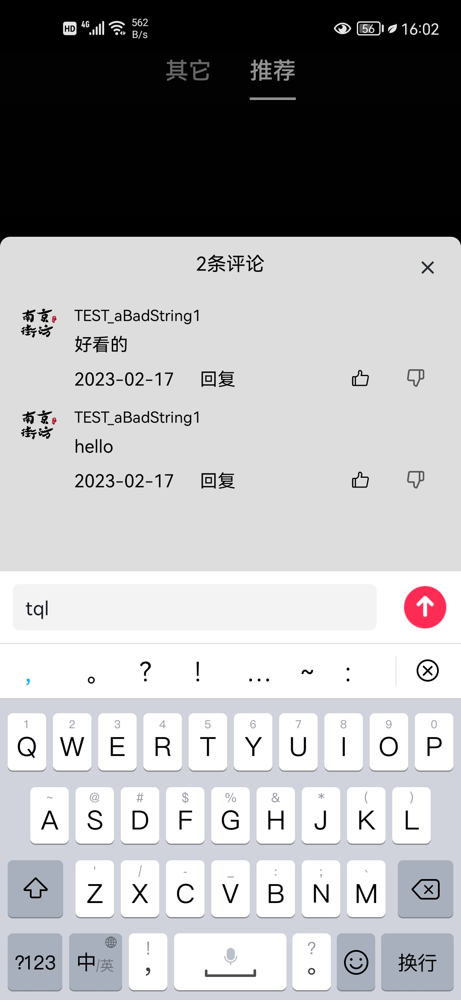
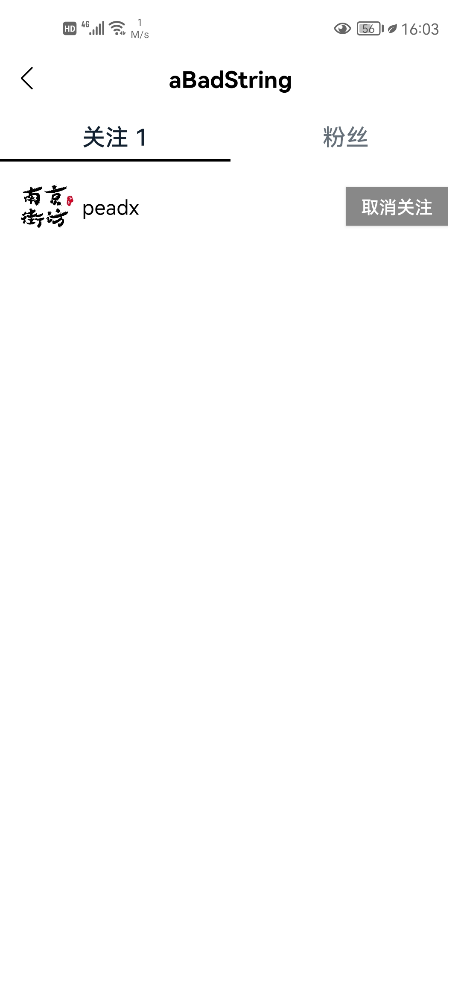

# 演示效果

<table>
  <tr>
    <td></td>
    <td></td>
    <td></td>
  </tr>
  <tr>
    <td></td>
    <td></td>
    <td></td>
  </tr>
</table>


# 安全

- 密码加盐哈希
- Token 防篡改, 无感刷新
- SQL 注入
- List 限制返回个数
- 上传文件, 防止脚本注入

# 高性能点赞

- 点赞存储到 redis
- 一旦有人请求某个用户的所有点赞过视频的接口时, 将 Redis 持久化到 MySQL

涉及的业务
- 当前用户是否点赞某个视频
- 某个用户点赞过的视频列表和数量
- 某个视频的被点赞数量
- 点赞、取消点赞

Redis 数据结构
```
userId - [video1, video2, ...]
```

# Token

Token 需要具备的特性:  
1. 随机性, 不可预测, 防猜测
2. 失效时间, 可以无感获取 (refresh)
3. 包含信息, 可以代表用户身份
4. 防篡改, 保证接收到的 Token 是服务端曾经发放过的
5. 服务端必须保存些什么, 以便主动失效掉 Token
