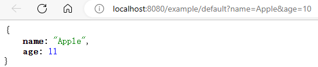
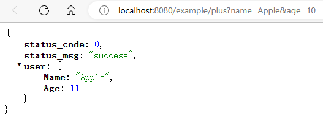
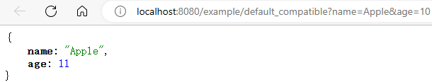
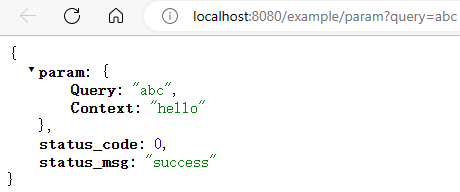
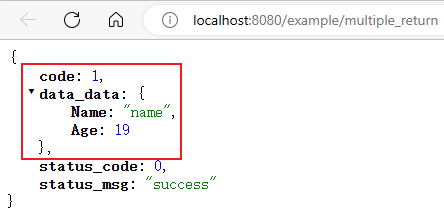
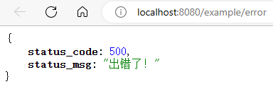
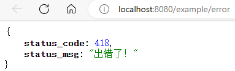

<h1 align="center">Gin 框架再封装</h1>


为简化开发工作和加强语义化业务函数，我们利用 Go 函数式编程的高阶函数的特性，通过添加一个**转换器** `HandlerFuncConverter(f any) gin.HandlerFunc`，使得任意形如 `func(...any) (...any, ...error)` 的函数都能被转化为可被 Gin 的路由组件所识别的 `gin.HandlerFunc` 函数（当然也**兼容 `type HandlerFunc func(*Context)`本身**）。

# 1. 怎么用

`HandlerFuncConverter` 的好处是能够简化业务函数的逻辑，并加强业务函数的语义，如下对比：  

下面的示例是使用 Gin 框架接受一个 GET 请求，需要两个参数：`name`、`age`，输出`name`、`age+1`：

```go
func main() {
    var ginEngine *gin.Engine = gin.Default()
    ginEngine.GET("/example/default", DefaultHandler)
    _ = ginEngine.Run()
}

func DefaultHandler(c *gin.Context) {
   name := c.Query("name")
   age := c.Query("age")

   user := User{Name: name}
   v, _ := strconv.ParseInt(age, 10, 64)
   user.Age = int(v) + 1

   c.JSON(http.StatusOK, user)
}
```



而下面是使用 `HandlerFuncConverter` 增强 Gin 后，完成相同功能的示例：

```go
func main() {
    var ginEngine *gin.Engine = gin.Default()
    ginEngine.GET("/example/plus", HandlerFuncConverter(PlusHandler))
    _ = ginEngine.Run()
}

func PlusHandler(user User) User {
   user.Age++
   return user
}

type User struct {
   Name string `query:"name"`
   Age  int    `query:"age"`
}
```


可以发现使用 `HandlerFuncConverter` 后，业务函数更专注于业务逻辑本身，免去了冗杂的参数获取和返回内容推送的代码。  
通过结构体 `User` 的定义更加明确了业务函数的输入和输出的数据结构。  
并且还能统一组织 `status_code` 等公共字段。

**并且 `HandlerFuncConverter` 还能够兼容原来的 Gin 的 `HandlerFunc` 写法：**
```go
func main() {
    var ginEngine *gin.Engine = gin.Default()
    ginEngine.GET("/example/default_compatible", HandlerFuncConverter(DefaultHandler))
    _ = ginEngine.Run()
}
```



# 2. 怎么实现的

该基础模块的核心是 [`HandlerFuncConverter` 函数](../../src/base/gin_extend.go)，其函数签名如下。该函数可以将任意形如 `func(...any) (...any, ...error)` 的函数转化为能够被 Gin 的路由所识别的 `gin.HandlerFunc` 函数类型。

```go
func HandlerFuncConverter(f any) gin.HandlerFunc {
    // ...
    return func(c *gin.Context) {
       // 1. 反射获取函数 f 的形参列表, 并从 HTTP 请求报文中获取实参
       paramNum := theF.Type().NumIn()
       params := make([]reflect.Value, paramNum)
       // ... 省略从 gin.Context 中获取实参数据的代码
       
       // 2. 调用函数 f
       var retValues []reflect.Value = theF.Call(params)
    
       // 3. 将返回值通过 c.JSON 写出到 HTTP 响应报文
       c.JSON(http.StatusOK, gin.H{
           "status_code": 0,
           "status_msg":  "",
           "data": retValues
        })
    }
}
```

`HandlerFuncConverter` 函数的主要设计思路就是：利用 Go 函数式编程的高阶函数的特性，返回一个对原始函数 `f` 包装后的新的类型是 `gin.HandlerFunc` 的函数。

该包装函数主要做三件事情：  
1. 获取请求参数：通过原始函数 `f` 的形参列表中结构体类型的 `tag` 标签和字段类型等信息，从 Gin 上下文对象 `gin.Context` 中获取请求报文的参数数据。
2. 执行原始函数 `f`：通过反射的特性调用业务函数。
3. 封装返回值：分析业务函数的返回值，将 `error` 的返回和正常数据的返回分离；根据是否有错误出现返回不同的 JSON 类型的数据。

# 3. 使用细节

## 3.1. 形参注入位置

`HandlerFuncConverter` 函数提供了 Query String、表单、Gin 上下文三个位置的实参数据注入，分别对应结构体字段标签 `query`, `form`, `context`。

```go
func ExampleParam() {
   var ginEngine *gin.Engine = gin.Default()
   ginEngine.Use(func(context *gin.Context) {
      context.Set("context", "hello")
   }).GET("/example/param", HandlerFuncConverter(ParamHandler))
   _ = ginEngine.Run()
   // http://localhost:8080/example/param?query=abc
}

type Param struct {
   Query   string `query:"query"`
   Form    string `form:"form"`
   Context string `context:"context"`
}

func ParamHandler(p Param) Param {
   return p
}
```



## 3.2. 多返回值

当业务函数返回多个返回值时，会以返回值类型的名作为 JSON 的 key（**转为对应的蛇形命名法**）挂在根对象下：

```go
func ExampleMultipleReturnValues() {
   var ginEngine *gin.Engine = gin.Default()
   ginEngine.GET("/example/multiple_return", HandlerFuncConverter(MultipleReturnHandler))
   _ = ginEngine.Run()
   // http://localhost:8080/example/multiple_return
}

type Code int
type DataData struct {
   Name string
   Age  int
}

func MultipleReturnHandler() (Code, DataData) {
   return 1, DataData{
      Name: "name",
      Age:  19,
   }
}
```



## 3.3. 错误处理

当业务函数的返回值列表中存在 error 接口或其子接口类型时，不会返回正常的数据，而是返回错误消息和状态码。

```go
func ExampleError() {
   var ginEngine *gin.Engine = gin.Default()
   ginEngine.GET("/example/error", HandlerFuncConverter(ErrorHandler))
   _ = ginEngine.Run()
   // http://localhost:8080/example/error
}

func ErrorHandler() (DataData, error) {
   return DataData{
      Name: "name",
      Age:  19,
   }, errors.New("出错了！")
}
```



### 3.3.1. 自定义错误码

可以通过错误工具函数 `base.NewError` 返回带错误码的错误实例

```go
func ErrorHandler() (DataData, error) {
   return DataData{
      Name: "name",
      Age:  19,
   }, NewError(418, "出错了！")
}
```

